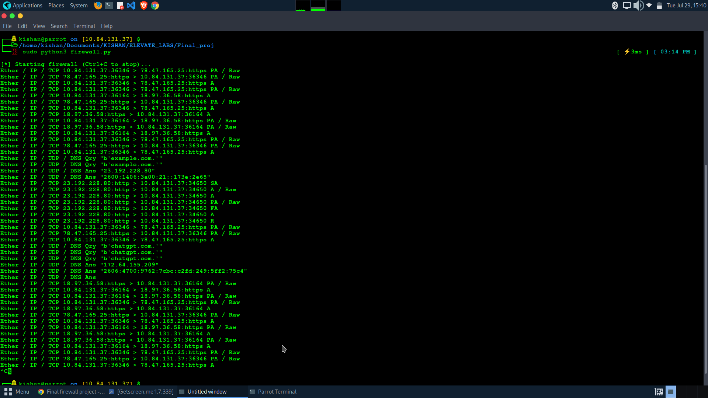
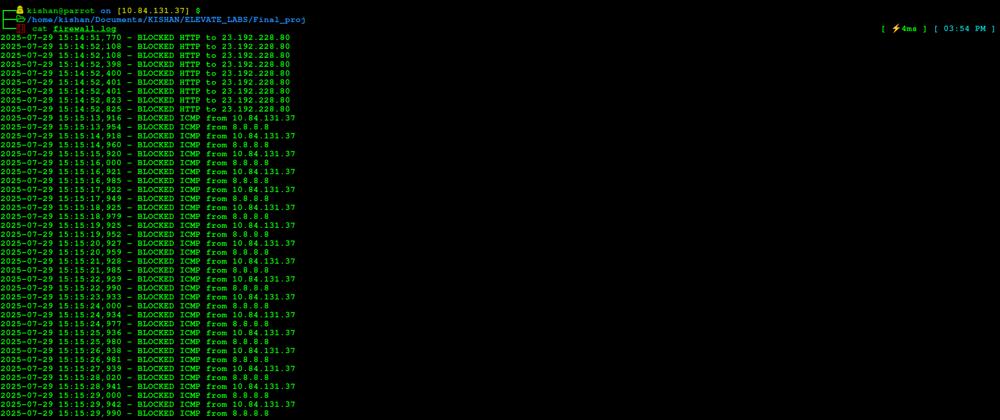

# Personal Firewall using Python and Scapy

---
A lightweight user-level firewall developed using Python 3 and Scapy. This project monitors live network traffic, blocks ICMP (ping) and HTTP (port 80) packets in real time, and logs the blocked attempts to a file. This project is developed for educational purposes under the course **20CYS402 – Distributed Systems and Cloud Computing**.

---

## Project Overview

This project implements a personal firewall using Python 3 and the Scapy library without using pip. It uses packet sniffing to monitor all incoming IP traffic and filters unwanted protocols such as ICMP and HTTP. This serves as a foundation for understanding how firewalls and packet filtering mechanisms work at a basic level in network security.

---

## Tools and Technologies Used

| Tool/Technology     | Purpose                                  |
|---------------------|------------------------------------------|
| **Linux (ParrotOS)** | OS for development and testing            |
| **Python 3.11.2**         | Programming language                    |
| **Scapy (System-installed)** | Packet sniffing and manipulation library |
| **Nano**     | Code editor                             |
| **Terminal**           | To run scripts with root privileges     |

> Note: Scapy is installed via system package manager — no pip used.

---

### Step 1: Environment Setup

Install Python and Scapy via system package manager:

```bash
sudo apt update
sudo apt install python3 python3-scapy
```
---

### ✅ Step 2: Create Project Directory

```bash
mkdir Final_proj
cd Final_proj
```
---

### Step 3: Create the Firewall Script

```bash
nano firewall.py

```

```bash
from scapy.all import *
import logging

logging.basicConfig(filename='firewall.log', level=logging.INFO, format='%(asctime)s - %(message)s')

def packet_filter(pkt):
    if pkt.haslayer(ICMP):
        logging.warning(f"BLOCKED ICMP from {pkt[IP].src}")
        return False
    elif pkt.haslayer(TCP) and pkt[TCP].dport == 80:
        logging.warning(f"BLOCKED HTTP to {pkt[IP].dst}")
        return False
    return True

if __name__ == "__main__":
    print("[*] Starting firewall (Ctrl+C to stop)...")
    try:
        sniff(filter="ip", prn=lambda x: x.summary(), lfilter=packet_filter)
    except KeyboardInterrupt:
        print("\n[!] Firewall stopped")

```

```bash
chmod +x firewall.py

```

### Step 4: Run the Firewall

```bash
sudo python3 firewall.py
```
<p align="center">
   
</p>


---

### Step 5: Generate Network Traffic

#### ICMP Test:

```bash
ping 8.8.8.8

```
#### HTTP Test:

```bash
curl http://example.com

```

### Step 6: View Log Output

```bash
cat firewall.log

```
### Saved firewall log 

<p align="center">
   
</p>

---
## Summary 

The Elevate Labs Cybersecurity Internship has significantly enhanced my understanding of real-world cybersecurity practices. Through their structured, task-based learning model, I was able to gain practical experience in areas such as reconnaissance, vulnerability analysis, exploitation, cryptography, and web application security.

Each task was designed to build progressively, and the final project phase gave me the opportunity to apply my learning independently. Working on the Personal Firewall project not only helped me strengthen my technical skills but also taught me how to manage a security-focused project from scratch — including scripting, testing, documenting, and delivering a complete solution.

Thanks to this internship, I have become more confident in developing cybersecurity tools, solving CTF-style challenges, and showcasing my skills through clean documentation and practical deliverables. It has prepared me to take on more advanced roles in ethical hacking, network defense, and cybersecurity research.

---
## Author and Submission Details

- **Name**: Yallanuru Kishan Sai 
- **Department**: B.Tech Cybersecurity  
- **Institution**: [Amrita Vishwa Vidyapeetam, Coimbatore]  
- **Semester**: 7th
- **Project Title**: Personal Firewall using Python and Scapy 
- **Submission Date**: 29 July 2025
- **Report** : [Report](./Project_Report.pdf)


